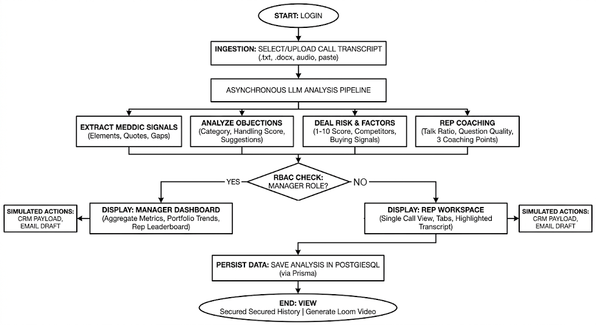

# Project Argus

Project Argus is a sales call intelligence workspace that turns transcripts into structured MEDDIC extraction, objection analysis, deal intelligence, and rep coaching.

## What it does
- Upload a transcript as `.txt`, `.docx`, `.mp3`, or `.wav`
- Paste raw transcript text directly into the UI
- Transcribe audio before analysis when needed
- Preserve speaker attribution when the transcript is labeled
- Render the extracted call intelligence in a tabbed React workspace
- Keep a manager dashboard for saved-call trend analysis and coaching review
- Generate a follow-up email draft and a CRM payload simulation

## Extraction design
The backend uses a prompt-driven JSON extraction pipeline. The response is normalized before it is stored so the UI always receives a consistent shape.

### MEDDIC prompt design
Project Argus uses a tightly constrained extraction prompt so the model behaves like a sales operations analyst rather than a free-form summarizer. This is the prompt contract that drives the MEDDIC extraction pipeline.

- **Strict JSON schema enforcement** keeps the response machine-readable and stable across calls.
- **Role prompting** instructs the model to act as an **Enterprise Sales Manager** focused on qualification, risk, and coaching.
- **Verbatim quote extraction** requires the model to cite the exact transcript fragment that supports each MEDDIC field.
- **Gap-aware output** marks missing or weak signals with a gap flag and includes a targeted follow-up question to ask next.
- **Normalization after generation** ensures the UI receives consistent field shapes even when upstream model output varies.
- **Submission-safe behavior** keeps the prompt narrow, reproducible, and aligned to the documented output schema.

### MEDDIC output shape
Each MEDDIC element is extracted with:
- `value`
- `confidence`
- `quote`
- `gapFlag`
- `gapRecommendation`

The completeness score is based on how many MEDDIC elements were extracted with at least medium confidence.

## Flowchart of Project


### Objections
Each objection includes:
- the objection text
- type: explicit or implicit
- category: price, timing, competition, need, or authority
- handling status: addressed, deflected, or missed
- a suggested better response

### Deal intelligence
The call output includes:
- deal risk score
- three cited risk factors
- competitor mentions
- buying signals
- next actions
- deal stage assessment

### Rep coaching
The call output includes:
- estimated talk ratio
- open-ended and closed question examples
- top coaching points tailored to the call

## Confidence scoring
- `High` means the transcript clearly supported the extraction.
- `Medium` means the signal was present but incomplete or indirect.
- `Low` means the signal was weak or ambiguous.
- `None` means the element was not discussed.

For MEDDIC completeness, the app treats High and Medium as meaningful coverage and flags low or missing items as gaps.

## Objection classification
Objections are classified by intent rather than literal wording.
- `Price`: cost, ROI, discounting, budget pressure
- `Timing`: delayed decisions, internal priorities, waiting for a better moment
- `Competition`: competitor comparisons or incumbent alternatives
- `Need`: unclear urgency, weak pain, or lack of business reason
- `Authority`: missing approver, procurement, security, or committee friction

## Async architecture
- Client uploads the transcript or pasted text.
- The server normalizes the input into raw transcript text.
- Audio is transcribed before the LLM extraction step.
- The LLM returns strict JSON.
- The server validates and normalizes the payload before saving it to PostgreSQL.
- The client renders the saved record immediately and keeps a history feed for review.

## Sample transcripts
Included in `server/`:
- `sample-early-discovery.txt`
- `sample-mid-cycle.txt`
- `sample-close-attempt.txt`
- `test-transcript.txt`
- `test2-auto-deal.txt`

## Run locally
- Start PostgreSQL and set `DATABASE_URL` in `server/.env`
- Run the server from `server/`
- Run the client from `client/`

## Notes
- `Sync to Salesforce` and follow-up email generation are simulated in the current UI.
- The manager dashboard uses saved history to compute portfolio metrics and trend views.

## Installation & Setup (Detailed)

### Download the repository

Clone the repo and open it locally:

```bash
git clone https://example.com/your-org/Project_Argus.git
cd Project_Argus
```

### Prerequisites
- Node.js 18+ and npm
- PostgreSQL reachable from your machine
- Environment variables set (see `server/.env`)

### Server: install and run
1. Change into the server folder and install dependencies:

```bash
cd server
npm install
```

2. Generate Prisma client and run migrations (first-time setup):

```bash
npx prisma generate
# If you have migrations to apply:
npx prisma migrate dev --name init
```

3. Start the server (development):

```bash
# Option A: simple start
node index.js

# Option B: use nodemon for autoreload (dev only)
npx nodemon index.js
```

4. The server exposes the analysis API (default port is configured inside `index.js` — check console output).

### Client: install and run
1. Change into the client folder and install dependencies:

```bash
cd ../client
npm install
```

2. Start the dev server:

```bash
npm run dev
```

3. Open the UI in your browser (Vite prints the local URL, usually `http://localhost:5173`).

### Useful commands
- Install a single server dependency (mammoth was used for `.docx` parsing):

```bash
cd server
npm install mammoth
```

- Install a single client dependency (example):

```bash
cd client
npm install recharts
```

### Files listing & requirements
- Server requirements file: [server/requirements.txt](server/requirements.txt)
- Client requirements file: [client/requirements.txt](client/requirements.txt)

These files list the Node.js minimums and key dependencies; prefer `npm install` in each folder for reproducible installs.

---

## Prisma Studio & Changing Default Role

Project uses Prisma for DB access. The `User` model (in `server/prisma/schema.prisma`) defines a `role` field with a default of `"REP"`.

There are two ways to change a user's role to `MANAGER`:

Option A — Edit an existing user's role via Prisma Studio (no schema change required):

1. Ensure `DATABASE_URL` is set in `server/.env` and the database is running.
2. From the `server/` folder run:

```bash
npx prisma studio
```

3. Prisma Studio will open in your browser. Find the `User` record you want to change and edit the `role` field to `MANAGER`. Save the change.

Option B — Change the default role in the Prisma schema and apply a migration (schema change):

1. Open `server/prisma/schema.prisma` and change the `role` default from `"REP"` to `"MANAGER"`:

```prisma
model User {
	id        String   @id @default(uuid())
	email     String   @unique
	password  String
	role      String   @default("MANAGER")
	createdAt DateTime @default(now())
	calls     CallAnalysis[]
}
```

2. Generate a migration:

```bash
npx prisma migrate dev --name change-default-role
npx prisma generate
```

3. New users will now default to `MANAGER` unless the `role` is set at creation time.

Notes:
- Use Option A to change individual user roles without changing schema.
- Use Option B only if you intentionally want the default for all new users to change.

---

## Additional notes for maintainers
- If you plan to add or change LLM providers, keep the prompt strictness and JSON-schema enforcement.
- For production, add job queues (Redis + BullMQ or similar) to offload heavy extraction tasks.
